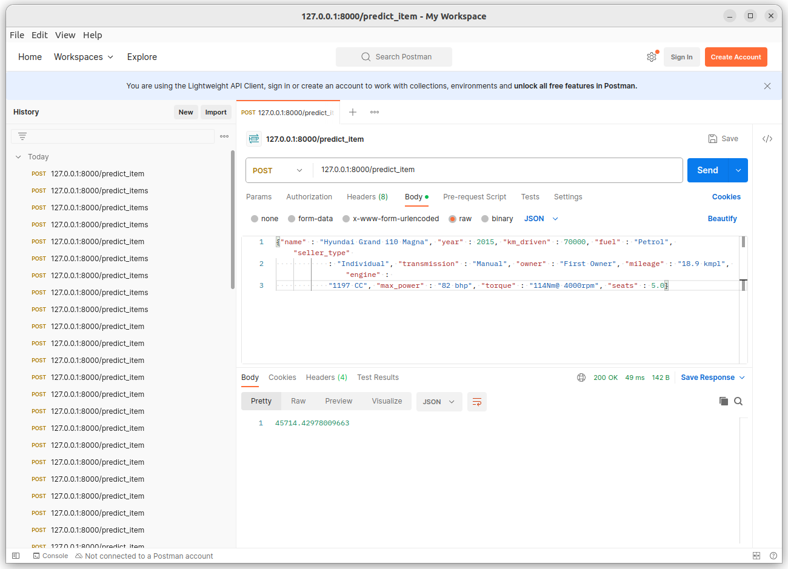
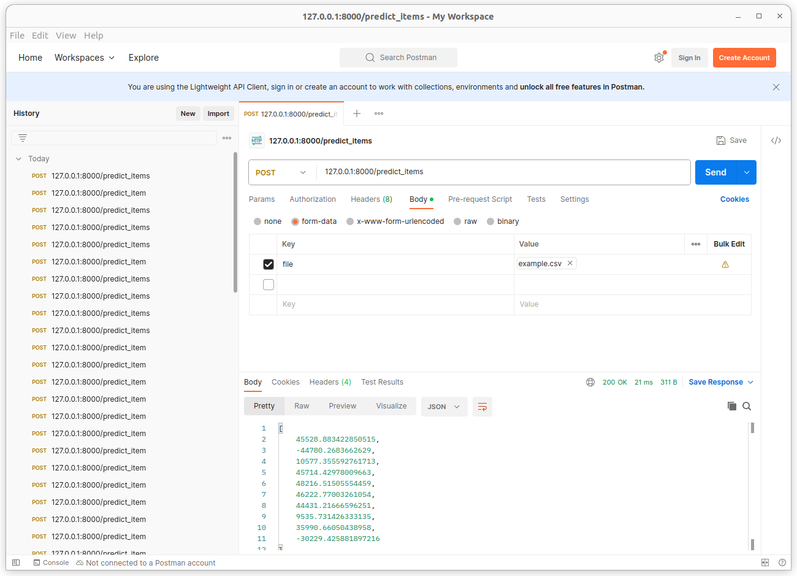

# used-car-price-predict-hw

Сделано:
1) Анализ данных
2) Обработка(приведение к консистентному виду, удаление пропусков, скейлинг)
3) Добавлены новые фичи: Крутящий момент, обороты, принадлежность к люксовой марке автомобиля
4) One-hot-encoding категориальных фич
5) Протестированы три модели с разными параметрами
   
Результаты:
   0.7079279497482611 на тесте у ElasticNet
   0.267 у бизнес-метрики
   -> модель требует доработки

Наибольший буст дало добавление новой фичи с люксовыми марками, скейлинг наоборот немного ухудшил показатели, 
в данных после уменьшения цен, остались несколько слишком высоких, но их уменьшение ведет к ухудшению качества.

Надо добавлять новые фичи (например парсить названия на предмет комплектаций авто) и пробовать перебирать больше параметров - не хватило времени все попробовать.

